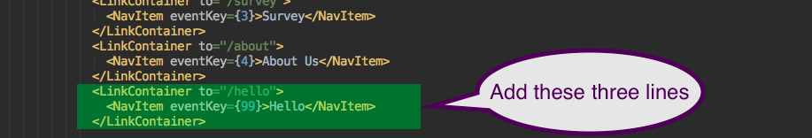

# Adding A Hello Page

This guide adds a `/hello` page to the sample application by 
following the existing outline.

## Using Ack on About

Searching strings is one way to [grok](https://en.wikipedia.org/wiki/Grok) the structure
of the kit and sample application.   You can use *grep* or [ack](http://beyondgrep.com) (`brew install ack`).
I use *ack* with this alias:

Looking with `ick about` and ignoring documentation, the word *about* appears in these files:

## Add the Hello page container

A new page requires new page renderer.  Copy the About page to a 
new directory and trim out almost all of it:

*  `cd ./src/containers && mkdir ./Hello` because each container goes in its own 
    directory by convention.
*  `cp About/About.js Hello/Hello.js`

Edit `Hello/Hello.js` into this file:

## Edit three files to add Hello

#### Add to `./src/containers/index.js` to include and export the React component:

#### Add to `./routes.js` to connect the `/hello` url path to the component:

#### Add to `./src/containers/App/App.js` to add "Hello" to the NavBar

And voila, the new 'Hello' page:

# Take-away:  Notice the trade-offs

The task of adding a new page exemplifies two trade-offs in the kit:
**code versus convention** and the **cut and paste** style.

Convention is a set of constraining rules that automatically trigger
routine configuration tasks.  For example, WebPack automatically picked up the 
new directory `./src/containers/Hello` without adding to any configuration files.

On the other hand, routine code was added to `./src/containers/index.js` and 
`./src/routes.js` to handle the new page.  A convention could automatically
accomplish the same tasks at either compile or run time.  The cost is new 
constraints, such as requiring `Hello/Hello.js` to be renamed
`HelloPage/HelloPage.js`.

Following a style in the code that has no automatic effects is just organic
growth, not convention.  For example, developers reading `./src/containers/index.js`
must stop and figure out why all subdirectories except `DevTools` are exported.
(`DevTools`)[`./src/containers/DevTools/DevTools.js`](https://github.com/erikras/react-redux-universal-hot-example/blob/master/src/containers/DevTools/DevTools.js)
contains a single function which should be
[randomly](https://github.com/erikras/react-redux-universal-hot-example/issues/808)
moved to `./src/utils` or `./src/helpers`.  Using a convention rule that all 
containers must contain an exported React component would raise an error.
Organic growth leads to disorder in a project.

Similarly, the **cut and paste** style of coding also degrades the project.
For example, In `App.js`, the new *NavItem* tag included a new value for the
*eventkey* property.  The *eventkey*  property is
[poorly](https://github.com/react-bootstrap/react-bootstrap/issues/320)
[understood](https://github.com/react-bootstrap/react-bootstrap/issues/432).
All *eventkey* fields in `App.js` are unused and can be removed.  The 
**cut and paste** style just compounds an
[old error](https://github.com/erikras/react-redux-universal-hot-example/commit/d67a79c1e7da5367dc8922019ca726e69d56bf0e)
and reinforces confusion.

The use of the **cut and paste** style raises well known issues in
maintenance, documentation, and code quality.  It is not for use in
production code.  

Some choices about trade-offs are easier than others.
