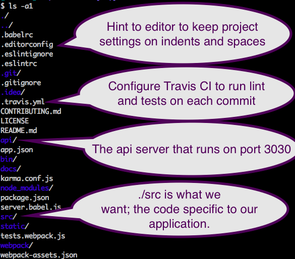
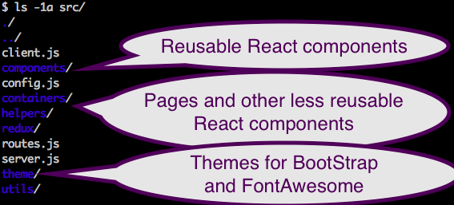
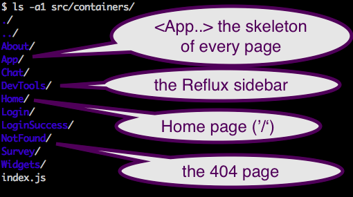
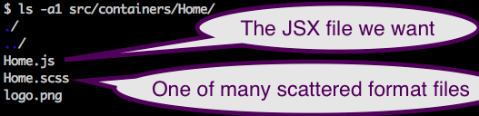
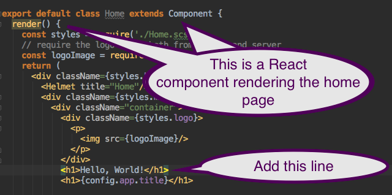

# Adding Hello, World as static text

Printing *Hello, World!* is a traditional task.  This guides you through adding the text "Hello, World!" to the
home page of the sample application.

## Find the home page

First, find the correct file to change by walking through the kit's directory tree:

So, the likely file is `src/containers/Home/Home.js`.

## Start the server and open the browser

Execute `npm run dev` and open http://localhost:3000:

*  `./package.json`, using [concurrently](https://www.npmjs.com/package/concurrently)
and [better-npm-run](https://www.npmjs.com/package/better-npm-run), runs 
 `./webpack/webpack-dev-server.js` on port 3001; runs `./bin/server.js` for HTTP on port 3000; 
 and runs `./bin/api.js` for the REST API on port 3030.
  
* `./bin/server.js` calls `./src/server.js` and uses the [HMR plugin](http://andrewhfarmer.com/webpack-hmr-tutorial/)
for hot reloading, meaning the browser refreshes automatically when any file in `./src` is changed.

* `./webpack/webpack-dev-server` does teh actual compilation with the 
[webpack dev middleware package](https://github.com/webpack/webpack-dev-middleware) to provide a key feature found
in Glup:  compilation without writing intermediate files to disk.  Configuring webpack
[can be confusing](https://medium.com/@dtothefp/why-can-t-anyone-write-a-simple-webpack-tutorial-d0b075db35ed#.cle1vv5ql).

* `./bin/api.js` calls `./api/api.js`.  It receives incoming REST requests as JSON objects and responds with
other JSON objects.   

## Change the text

Add the static text to (`src/containers/Home/Home.js`):

When you save the file to disk, the change to the `./src` directory is picked up by the 
[piping](https://www.npmjs.com/package/piping) module, triggering the webpack-dev-server to rebuild 
`./static/dist/[checksum].js`, and triggering a stub injected into the HTML file served to the browser to 
reload.   The rebuilding processes through webpack middleware and plugins that compile `*.sccs` files, 
transpile JAX and ES6 (or ES7), and bundles together all the resources into one package in about 6 seconds.
That is, the browser will show "Hello, World!" on your web page in about 6 seconds:

## Conclusion

You added **Hello, World!**.   The process is [as clear as is the summer's sun](https://www.youtube.com/watch?v=EhGiSfv5FJk&t=3m23s).

