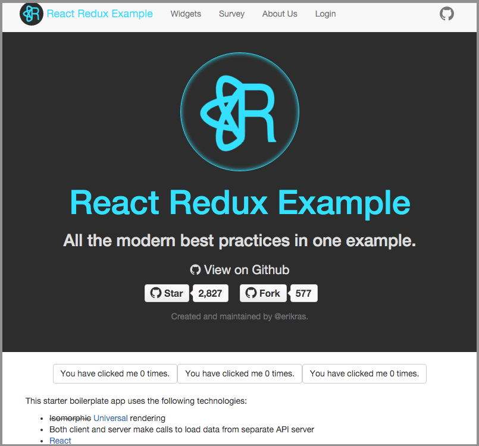
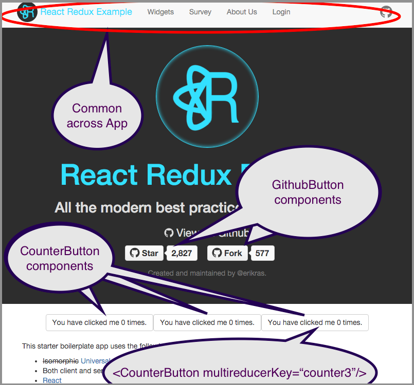
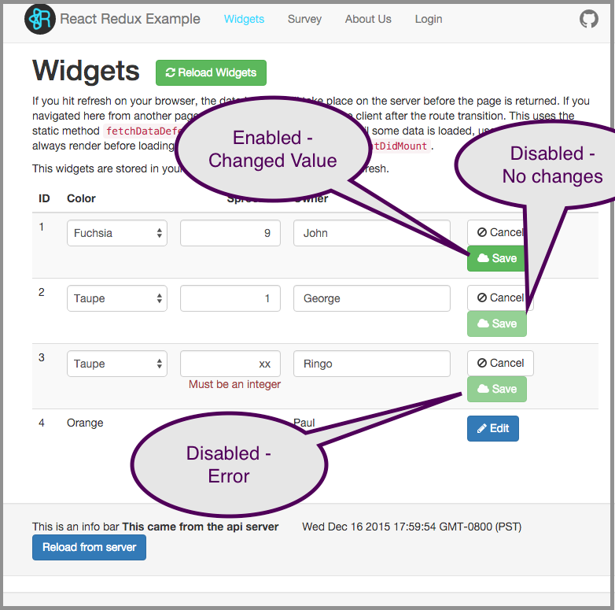
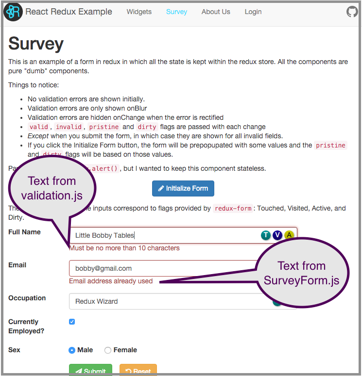
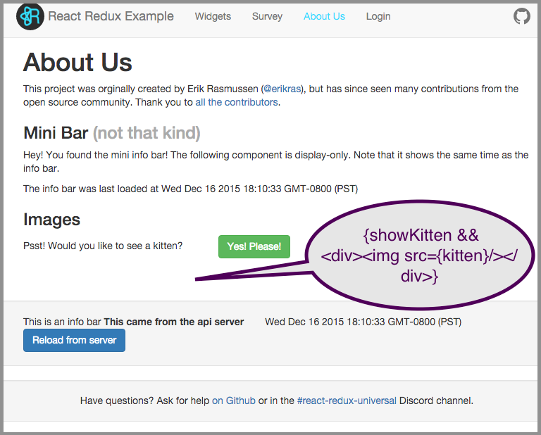

# Guide - Exploring the Demo App

This guide covers your first look and can be used even before installing software.  

## Overview

This project is a kit for developing interactive applications in JavaScript centered
around React and Redux.  Like all JavaScript kits, it includes a large number of configured
modules and a sample, or Demo App, from which to start your application.  This guide walks 
through that Demo App to show some features and code.

### Open the demo in your browser

The project hosts a running demo on Heroku, a hosting company.  Open 
[https://react-redux.herokuapp.com/](https://react-redux.herokuapp.com/) in your browser to see this page:

Much of the text is cut-and-paste from the project's 
[README.md](https://github.com/erikras/react-redux-universal-hot-example/blob/master/README.md) file into 
the code for this page [./src/containers/Home/Home.js](https://github.com/erikras/react-redux-universal-hot-example/blob/master/src/containers/Home/Home.js).  

The text provides a one line overview of about twenty of the main 
modules of hundreds shown during installation.   The selection 
and configuration of all these modules is the value of using a kit.   When you run across
a module you have never heard of and want to get a quick overview, the fastest way is
to google for 'slideshare theModuleName' and skim someone's presentation.

The page is rendered from HTML including React components coded as custom HTML tags.
The components use properties to alter appearance and sets of data.  Notice some of the components on the page:

### Explore the Widgets Page

Click on *Widgets* link on the top of the screen.   You come to a page with some arbitrary widgets and more logic
in the form.  Notice how much state affects the display and formatting of buttons:

### Explore the Survey Page

Click on the *Survey* link.  Following the programming style of this kit, the code for this page is 
spread over a [Survey container][scont], a [SurveyForm component][scomp], mentioned in the 
[container][conlist] and [component][complist] lists, 
mentioned in the [routes][routes] function and the navigation of the main [App][app].  The code also uses
various libraries for React, Redux, validation, memoize and other functions.   Learn to use [ack](http://beyondgrep.com) 
or the project wide search built into your editor.

Try clicking on the 'Initialize Form' button and then hitting Submit.  You will see just an error under
'Little Bobby Tables'.  Now click in the email field then the name field.   You now see errors in both
the name and the email.  Even with a good kit, forms can be difficult to code.

[scont]: https://github.com/erikras/react-redux-universal-hot-example/tree/master/src/containers/Survey
[scomp]: https://github.com/erikras/react-redux-universal-hot-example/tree/master/src/components/SurveyForm
[conlist]: https://github.com/erikras/react-redux-universal-hot-example/blob/master/src/containers/index.js
[complist]: https://github.com/erikras/react-redux-universal-hot-example/blob/master/src/components/index.js
[routes]: https://github.com/erikras/react-redux-universal-hot-example/blob/master/src/routes.js
[app]: https://github.com/erikras/react-redux-universal-hot-example/tree/master/src/containers/App/App.js

### Explore the About Page

Click on the *About* link.   The source for this page 
[./src/containers/About/About.js](https://github.com/erikras/react-redux-universal-hot-example/blob/master/src/containers/About/About.js)
uses a casual mix of HTML, ECMA7 JavaScript, and React components.   This translates into 
simple JavaScript code for the browser.   Notice how the local state `showKitten` being false causes no
`div` or `img` tag in the output.

### Explore the Login Page

Finally, click on the *Login* page and explore.   Looking at the styling for this page 
[./src/containers/Login/Login.scss]](https://github.com/erikras/react-redux-universal-hot-example/blob/master/src/containers/Login/Login.scss)
will show an example of how the using styling files litters the code base with extra files.   
Consider the alternative of using 
[Inline Styles](https://github.com/erikras/react-redux-universal-hot-example/blob/master/docs/InlineStyles.md).

# The Take Away

Looking through each page of the DemoApp will lead you to more questions which will keep you 
searching and learning and you will slowly master this technology.

Here are some additional quests you could undertake:

* How do the About page MiniBar and the status bar share data about the time last loaded?
* How would you add a fourth counter that incremented by two?   How many files would you need
  to touch?
* What order are calls made when you click "Reload Widgets" on the widgets page?
* Why does surveyValidation use memoize?

Install, hack, explore!

*All guides are works in progress, and pull requests are always welcome.  If you make an
accepted pull request and live in Silicon Valley, I'll treat you to coffee.  -- Charles*

